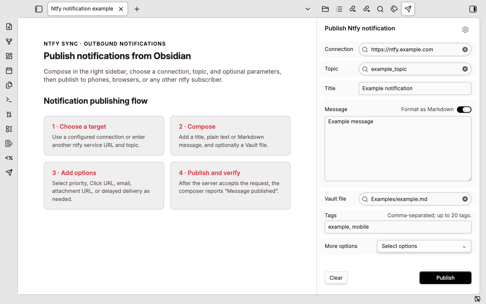
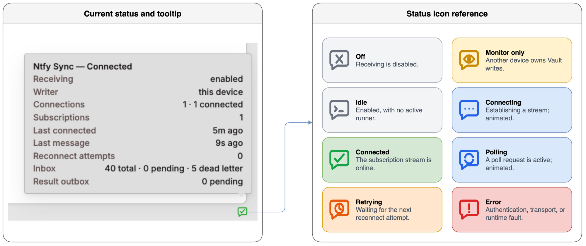

# Ntfy Sync

[English](README.md) | [简体中文](README_CN.md)

Ntfy Sync connects Obsidian desktop to a user-configured ntfy server. Messages published from mobile apps, browser extensions, scripts, or other ntfy clients are received through streaming or polling, then routed into Markdown notes using ordered, first-match rules. Rules can match topics, titles, message content, tags, priority, URLs, and attachment metadata, while configurable templates control the destination note, inserted content, insertion mode, and attachment path.

Accepted messages are persisted before processing, and idempotency markers prevent duplicate Vault writes during reconnects or replay. The plugin supports authenticated public and self-hosted ntfy servers, guarded same-origin attachment downloads, durable recovery, dead-letter retries, redacted diagnostics, and optional publication of processing results to a separate ntfy topic. Ntfy Sync is desktop-only.

## Message flow


1. **Message sources** — mobile, desktop, and web clients; browser, CLI, and API integrations; webhooks; and automation publish messages over HTTPS.
2. **ntfy.sh server** — provides topic publish/subscribe, message caching, and replay.
3. **Ntfy Sync plugin** — subscribes by NDJSON stream or poll, persists accepted messages, and applies deterministic first-match rules.
4. **Markdown queues** — receive routed notes and attachments with idempotency markers in the Obsidian Vault.
5. **Clipping workers** — consume queued links, fetch remote text and media, and create or enrich clipped notes.
6. **Knowledge base** — retains Markdown notes and local files, organized through backlinks and tags for searchable, reusable, durable knowledge.

## Features

### Receive and route

- Native NDJSON stream, periodic poll, overlap replay, reconnect backoff, and automatic stream-to-poll fallback.
- Checksum JSON durable inbox with backup recovery, bounded retention, dead letters, and manual retry.
- One generic Inbox rule for new installations; users add domain-, topic-, or tag-specific routes in the structured rule editor.
- Same-origin attachment download with redirect and byte controls; cross-origin attachments remain escaped links.
- Ordered **Message distribution rules** cards with quick enable/disable, add, edit, delete, and priority controls.

### Send

- Right-sidebar **Publish Ntfy notification** composer with editable connection, topic, title, tags, Markdown, Vault or URL attachments, and priority.
- Built-in **Publish test** dialog for publishing a test message to a configured input topic.
- Optional minimal or path-bearing result outbox for publishing processing outcomes to a separate topic.

## Initial configuration

If ntfy is new to you, start with the official [ntfy Getting started guide](https://docs.ntfy.sh/#getting-started), which covers subscribing to a topic and sending the first message.

1. Create separate, non-guessable input and result topics. On self-hosted ntfy, use the smallest read/write ACLs that satisfy each direction.
2. Open **Settings → Community plugins → Ntfy Sync** and configure the server, input topics, transport mode, and read authentication.
3. Optionally publish processing results to a separate topic with its own write credential. Minimal privacy and result caching are enabled by default.
4. Review **Message distribution rules**. Rules are evaluated from top to bottom; use the arrows to change priority.
5. After editing the rules, select **Publish test** beside **Apply** to verify that the message is routed into the expected note.
6. Use the ribbon icon or run **Ntfy Sync: Open message composer** to publish notifications from the right sidebar.

## Publish Ntfy notifications

Open the right-sidebar composer to complete the publish flow without a browser or command-line request.



1. Choose a configured connection and suggested topic.
2. Add a title and plain-text or Markdown message; optionally attach one file from the current Vault.
3. Add tags or expand **More options** for priority, Click URL, email forwarding, a remote attachment, and delayed delivery.
4. Select **Publish** or press `Ctrl/Cmd+Enter`.

Available Obsidian commands:

- **Ntfy Sync: Open message composer**
- **Ntfy Sync: Send selection**
- **Ntfy Sync: Send current note link**
- **Ntfy Sync: Send active Vault file**

## Interface tour

The three settings views below cover receiving, routing, and rule editing. All values shown are synthetic examples.

### General settings

Configure message receiving and the ntfy connection.


### Rule list

Rules are evaluated from top to bottom. Each rule provides quick enable/disable, priority, edit, and delete controls.


### Rule configuration

Rules use ordered, first-match evaluation. Configure conditions and the target note in the structured editor; place a catch-all rule last.


See the [configuration reference](docs/configuration-reference.md) for rule fields, condition operators, path constraints, and template variables.

## Status indicator

The status-bar bubble distinguishes **off**, **monitor only**, **idle**, **connecting**, **connected**, **polling**, **retrying**, and **error**. Connecting and polling use subtle motion, and hovering shows a detailed status summary.



| Tooltip line | Meaning |
| --- | --- |
| `Ntfy Sync — Connected` | Overall state derived from the plugin switch and all connection runners. |
| `Receiving: enabled` | Whether inbound processing is enabled in plugin settings. |
| `Writer: this device` | Whether this device owns Vault writes. `another device` means monitor-only operation. |
| `Connections: 1 · 1 connected` | Total configured connection runners followed by their current state distribution. |
| `Subscriptions: 1` | Total configured input subscriptions across all connections. Topic names are never shown. |
| `Last connected: just now` | Relative time of the most recent successful connection. |
| `Last message: just now` | Relative time of the most recently received event. Message content is never shown. |
| `Reconnect attempts: 0` | Sum of reconnect attempts across active connection runners. |
| `Last fault: <code>` | Error code shown only when a transport fault exists. |
| `Inbox: 4 total · 0 pending · 0 dead letter` | Durable inbox totals and unresolved/dead-letter counts. |
| `Result outbox: 0 pending` | Results waiting to be published. |

## Runtime commands

- **Ntfy Sync: Reconnect** — stop and recreate transports from validated settings.
- **Ntfy Sync: Retry dead-letter messages** — requeue failures without erasing error history.
- **Ntfy Sync: Export redacted diagnostics** — write a body/credential/topic-safe summary under `Obsidian/ntfy/`.

## Recovery and rollback

Runtime state is stored beside the plugin as `state-v1.json`, with a checksum and previous snapshot backup. A corrupt primary is isolated and recovered from the backup; if both copies are corrupt, the plugin stops instead of silently rebuilding and replaying everything. Preserve the corrupt files for diagnosis and use the redacted diagnostics command before manual recovery.

To roll back, disable **Ntfy Sync** first and confirm its status is off. Disabling aborts streams and poll timers but does not delete notes or attachments already written. Only after ntfy input has stopped should another ingress be enabled for the corresponding route; never let two transports write the same queue unless the downstream workflow is independently idempotent.

## Requirements and build

- Obsidian 1.12.7 or newer on desktop.
- Node.js 22 or newer for development (`.nvmrc` and CI use Node 22).

```sh
npm ci
npm run verify
```

The installable files are `main.js`, `manifest.json`, and `styles.css`. For the isolated test Vault:

```sh
npm run build
npm run install:test-vault
```

Set `OBSIDIAN_NTFY_TEST_VAULT` to an isolated Vault whose directory name contains `test`. `install:test-vault` rejects any other target. Manual production installation should happen only after the deployment checks below.

## Automated acceptance

| Command | Coverage |
| --- | --- |
| `npm run verify` | Formatting, lint, type checking, unit/contract/integration tests, coverage, secret scanning, build, reproducibility, and release-package checks. |
| `npm run test:ui` | Installs the build into an isolated test Vault, exercises the rule editor, verifies persistence and reload, and restores the original settings. |
| `npm run test:acceptance` | Runs the UI gate plus stream and poll scenarios covering reconnects, attachments, duplicate prevention, result privacy, rollback, and cleanup. |

Acceptance reports are written under the ignored `.artifacts/` directory.

## Security and known limits

- Credentials are stored in Obsidian `data.json`; local filesystem and Vault Sync permissions are the security boundary.
- Idempotency markers provide effective-once Vault writes, not distributed exactly-once delivery. Messages older than the ntfy server cache cannot be recovered.
- The plugin does not execute ntfy actions, mirror remote delete/clear events, or support mobile background operation.
- Validate sleep/wake behavior and deployment-specific TLS, CORS, proxy, and cache settings before production use. See [SECURITY.md](SECURITY.md).

## License and provenance

Licensed under `AGPL-3.0-only`, Inspired by Obsidian Telegram Sync.
