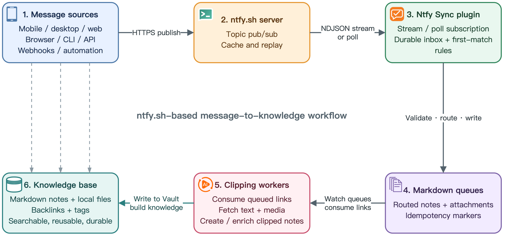
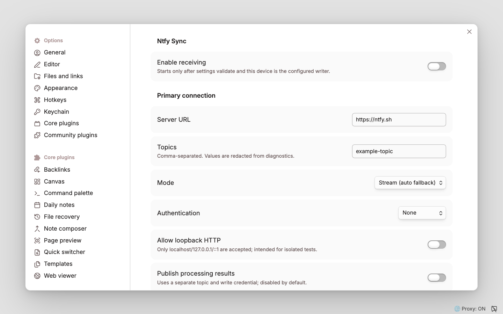
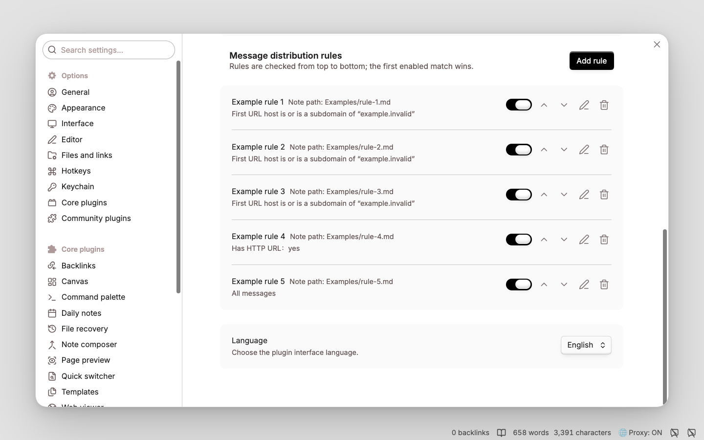
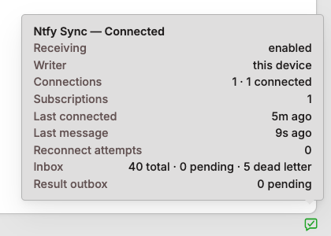

# obsidian-ntfy-sync

[English](README.md) | [简体中文](README_CN.md)

Ntfy Sync connects Obsidian desktop to a user-configured ntfy server. Messages published from mobile apps, browser extensions, scripts, or other ntfy clients are received through streaming or polling, then routed into Markdown notes using ordered, first-match rules. Rules can match topics, titles, message content, tags, priority, URLs, and attachment metadata, while configurable templates control the destination note, inserted content, insertion mode, and attachment path.

Accepted messages are persisted before processing, and idempotency markers prevent duplicate Vault writes during reconnects or replay. The plugin supports authenticated public and self-hosted ntfy servers, guarded same-origin attachment downloads, durable recovery, dead-letter retries, redacted diagnostics, and optional publication of processing results to a separate ntfy topic. Ntfy Sync is desktop-only.

## Message flow



1. **Message sources** — mobile, desktop, and web clients; browser, CLI, and API integrations; webhooks; and automation publish messages over HTTPS.
2. **ntfy.sh server** — provides topic publish/subscribe, message caching, and replay.
3. **Ntfy Sync plugin** — subscribes by NDJSON stream or poll, persists accepted messages, and applies deterministic first-match rules.
4. **Markdown queues** — receive routed notes and attachments with idempotency markers in the Obsidian Vault.
5. **Clipping workers** — consume queued links, fetch remote text and media, and create or enrich clipped notes.
6. **Knowledge base** — retains Markdown notes and local files, organized through backlinks and tags for searchable, reusable, durable knowledge.

## Features

- Native NDJSON stream, periodic poll, overlap replay, reconnect backoff, and automatic stream-to-poll fallback.
- Multiple connection groups in the core model; Basic/Bearer read auth and separate result auth.
- Checksum JSON durable inbox with backup recovery, bounded retention, dead letters, and manual retry.
- One generic Inbox rule for new installations; users add domain-, topic-, or tag-specific routes in the structured rule editor.
- Strict rules/templates and Vault-relative paths with a forced `ntfy-sync:v1` marker.
- Same-origin attachment download with redirect and byte controls; cross-origin attachments remain escaped links.
- Optional minimal or path-bearing result outbox, status bar, and redacted diagnostic export.
- Theme-aware **Ntfy Sync** status indicator with eight distinct states. Hover or keyboard focus shows redacted connection, activity, retry, inbox, and result-outbox details.
- Ordered **Message distribution rules** cards with quick enable/disable, add/edit/delete, priority arrows, structured all-condition editing, searchable path fields, validation-before-save, revision tracking, and reload-safe persistence.
- English and Simplified Chinese plugin interfaces, with **Follow Obsidian** as the default and explicit language overrides that persist across reloads.
- Searchable settings on Obsidian 1.13 and later, with the same settings UI retained for Obsidian 1.12.7.

## Initial configuration

If ntfy is new to you, start with the official [ntfy Getting started guide](https://docs.ntfy.sh/#getting-started), which covers subscribing to a topic and sending the first message.

1. Create separate, non-guessable input and result topics. On self-hosted ntfy, use the smallest read/write ACLs that satisfy each direction.
2. Open **Settings → Community plugins → Ntfy Sync** and configure the server, input topics, transport mode, and read authentication. Each topic must use 1–64 ASCII letters, numbers, underscores, or dashes, matching the official ntfy topic format. HTTP is accepted only for explicit loopback testing.
3. Optionally publish processing results to a separate topic with its own write credential. Minimal privacy and result caching are enabled by default.
4. Review **Message distribution rules**. The list is evaluated top-to-bottom; use the arrows to change priority, or use **Add rule** on the right side of the section heading / edit to configure structured conditions, target note, template, insertion mode, heading, and attachment path.

## Configuration screenshots

### General settings

Configure receiving, the primary ntfy connection, transport mode, authentication, and optional result publishing.



### Rule list

Rules are evaluated from top to bottom. Each card provides quick enable/disable, priority, edit, and delete controls. The infrequently changed plugin language selector stays at the bottom, immediately above **Apply**.



### Rule configuration

- Rules are evaluated from top to bottom.
- Disabled rules are skipped; the first enabled rule whose conditions all match takes effect, and matching then stops.
- Conditions within a rule use **AND** logic. To express OR, create multiple rules with the same action.
- A rule with no conditions matches every message, so a catch-all rule should normally be last.

| Setting | Description |
| --- | --- |
| **Rule name** | A readable label shown in the ordered rule list. It does not affect matching. |
| **Enabled** | Includes or excludes the rule from evaluation without deleting it. |
| **Conditions** | All listed conditions must match. **Add condition** adds another AND condition; no conditions means all messages. |
| **Note path template** | Vault-relative destination ending in `.md`, for example `Ntfy Sync/{{messageDate:YYYY-MM}}.md`. Absolute paths, `.`/`..`, empty path components, and paths outside the Vault are invalid. |
| **Content template** | Selects the configured template used to render the message block. Every written block also receives the forced `ntfy-sync:v1` marker for idempotency. |
| **Insertion mode** | **Append** writes at the end; **Prepend** writes at the beginning; **After heading** writes at the end of the named Markdown section. |
| **Heading** | Required for **After heading** and matched as an exact trimmed Markdown heading such as `### Inbox`. If absent from the note, the heading is created before the block is inserted. |
| **Attachment path template** | Optional Vault-relative target for an automatically downloaded attachment. It is used only when attachment downloading is enabled and the attachment satisfies the same-origin/security policy; otherwise the content receives a link to the attachment. Leaving it blank selects link-only behavior. |

#### Conditions

Text matching is case-sensitive. Empty string values are invalid. ntfy priority is `1` (minimum) through `5` (maximum), and defaults to `3` when the publisher omits it.

| Field | Available operators | What is matched / example |
| --- | --- | --- |
| **Topic** | `equals`, `contains`, `starts with` | The exact source topic string. `equals` is safest when routing one topic. |
| **Title** | `equals`, `contains`, `starts with` | The optional ntfy title; a missing title is an empty string. |
| **Message body** | `equals`, `contains`, `starts with` | The ntfy message text. These are literal, case-sensitive comparisons, not regular expressions. |
| **Has tag** | `is` | Whether the message tag array contains one complete, case-sensitive tag. `urgent` does not match a tag named `very-urgent`. |
| **Priority** | `equals`, `is at least` | The numeric ntfy priority. `is at least 4` matches priorities 4 and 5. |
| **Has attachment** | `equals` with Yes/No | Whether ntfy supplied an attachment descriptor; this does not mean the attachment was downloaded successfully. |
| **Has HTTP URL** | `equals` with Yes/No | Whether a valid `http://` or `https://` URL was found while scanning the title first and then the message body. The ntfy click-action URL is not used by this condition. |
| **Attachment MIME type** | `equals`, `starts with` | The MIME type announced by ntfy, such as `image/png`; `starts with image/` matches any announced image type. The searchable field offers common MIME presets and a clear control while continuing to accept custom values. A missing MIME type does not match a non-empty value. |
| **First URL host** | `host equals`, `host or subdomain of` | The hostname of the first HTTP(S) URL found in the title/body. Enter only a host such as `github.com`, without a scheme, port, or path. Hostnames are IDNA-normalized and lowercased. `host or subdomain of` matches `github.com` and `docs.github.com`, but not `evilgithub.com`. |

Operator meanings vary slightly by field:

- `equals` compares the complete value; for text fields it is case-sensitive.
- `contains` is a literal substring check for Topic, Title, and Message body.
- `is` checks for one complete item in the message tag array.
- `starts with` is a literal prefix check. For Attachment MIME type, a value such as `image/` matches the whole MIME family.
- `is at least` is a numeric `>=` comparison.
- `host equals` matches one normalized hostname exactly; `host or subdomain of` additionally accepts labels below that hostname while preserving the domain boundary.

#### Path and content template variables

The note path, attachment path, and content templates support the following variables. Date/time values are rendered in UTC. Supported date format tokens are `YYYY`, `MM`, `DD`, `HH` (24-hour), `hh` (12-hour), `mm`, `ss`, and `SSS`; separators such as `-`, `/`, `_`, spaces, and `:` are allowed.

| Variable | Value |
| --- | --- |
| `{{content}}`, `{{content:N}}` | Full message body, or its first `N` characters. |
| `{{title}}`, `{{topic}}` | Message title and source topic. |
| `{{messageId}}`, `{{sequenceId}}` | ntfy message ID and optional sequence ID. |
| `{{priority}}` | Priority from 1 through 5. |
| `{{tags}}`, `{{tag:[N]}}` | Comma-separated tags, or the zero-based tag at index `N`. |
| `{{url1}}`, `{{url1:host}}` | First HTTP(S) URL found in title/body, and its normalized hostname. |
| `{{attachment:name}}`, `{{attachment:type}}` | Announced attachment filename and MIME type. |
| `{{messageDate:FORMAT}}`, `{{messageTime:FORMAT}}` | ntfy publication time using the requested format. |
| `{{receivedDate:FORMAT}}` | Local receipt time using the requested format. |
| `{{file:path}}`, `{{file:link}}`, `{{file:embed}}` | Downloaded attachment path, wikilink, and embed. These are intended for content templates and are empty when no attachment target is available. |

Use only the listed variables. Settings validation rejects unsupported variables before a rule can be saved or enabled. Dynamic path components are sanitized, but the resulting path must still be a valid Vault-relative path.

Example order:

1. **GitHub links** — `First URL host` / `host or subdomain of` / `github.com` → `Clippings/GitHub.md`.
2. **High priority** — `Priority` / `is at least` / `4` → `Ntfy Sync/Urgent.md`.
3. **Inbox fallback** — no conditions → `Ntfy Sync/Inbox.md`.

With this order, a priority-5 GitHub message is handled by **GitHub links**, because first-match evaluation stops before **High priority**.


## Status indicator

The status-bar bubble distinguishes **off**, **monitor only**, **idle**, **connecting**, **connected**, **polling**, **retrying**, and **error**. Connecting and polling use subtle motion unless the operating system requests reduced motion.

Double-click the icon to open **Settings → Ntfy Sync** directly; keyboard users can focus it and press Enter or Space. Hover or focus the icon for a detailed status summary. It includes receiving/writer state, connection-state counts, subscription count, relative activity times, retry/fault codes, and queue counts. It never includes server URLs, topic names, credentials, message bodies, or raw error text. The popup uses Obsidian theme variables in both light and dark themes rather than a fixed black background. Detail labels align on the left and their values align on the right for quick scanning.



| Tooltip line | Meaning |
| --- | --- |
| `Ntfy Sync — Connected` | Overall state derived from enabled/writer state and all connection runners. Other values are Off, Monitor only, Idle, Connecting, Polling, Retrying, and Error. |
| `Receiving: enabled` | Whether inbound processing is enabled in plugin settings. |
| `Writer: this device` | Whether this device owns Vault writes. `another device` means monitor-only operation. |
| `Connections: 1 · 1 connected` | Total configured connection runners followed by their current state distribution. |
| `Subscriptions: 1` | Total configured input subscriptions across all connections. Topic names are never shown. |
| `Last connected: just now` | Relative time of the most recent successful connection. |
| `Last message: just now` | Relative time of the most recently received event. Message content is never shown. |
| `Reconnect attempts: 0` | Sum of reconnect attempts across active connection runners. |
| `Last fault: <code>` | Present only when a transport fault exists; exposes a stable fault code, not the raw error, URL, or credential. |
| `Inbox: 4 total · 0 pending · 0 dead letter` | Durable inbox totals and unresolved/dead-letter counts. |
| `Result outbox: 0 pending` | Results waiting to be published; publishing failures do not roll back committed Vault writes. |

## Runtime commands

- **Ntfy Sync: Reconnect** — stop and recreate transports from validated settings.
- **Ntfy Sync: Retry dead-letter messages** — requeue failures without erasing error history.
- **Ntfy Sync: Export redacted diagnostics** — write a body/credential/topic-safe summary under `Obsidian/ntfy/`.

## Recovery and rollback

Runtime state is stored beside the plugin as `state-v1.json`, with a checksum and previous snapshot backup. A corrupt primary is isolated and recovered from the backup; if both copies are corrupt, the plugin stops instead of silently rebuilding and replaying everything. Preserve the corrupt files for diagnosis and use the redacted diagnostics command before manual recovery.

To roll back, disable **Ntfy Sync** first and confirm its status is off. Disabling aborts streams and poll timers but does not delete notes or attachments already written. Only after ntfy input has stopped should another ingress be enabled for the corresponding route; never let two transports write the same queue unless the downstream workflow is independently idempotent.

## Requirements and build

- Obsidian 1.12.7 or newer on desktop.
- Node.js 22 or newer for development (`.nvmrc` and CI use Node 22).

```sh
npm ci
npm run verify
```

The installable files are `main.js`, `manifest.json`, and `styles.css`. For the isolated test Vault:

```sh
npm run build
npm run install:test-vault
```

Set `OBSIDIAN_NTFY_TEST_VAULT` to an isolated Vault whose directory name contains `test`. `install:test-vault` rejects any other target. Manual production installation should happen only after the deployment checks below.

## Automated acceptance

| Command | Coverage |
| --- | --- |
| `npm run verify` | Formatting, lint, type checking, unit/contract/integration tests, coverage, secret scanning, build, reproducibility, and release-package checks. |
| `npm run test:ui` | Installs the build into an isolated test Vault, exercises the rule editor, verifies persistence and reload, and restores the original settings. |
| `npm run test:acceptance` | Runs the UI gate plus stream and poll scenarios covering reconnects, attachments, duplicate prevention, result privacy, rollback, and cleanup. |

Acceptance reports are written under the ignored `.artifacts/` directory.

## Security and known limits

- Credentials are stored in Obsidian `data.json`; local filesystem and Vault Sync permissions are the security boundary.
- Idempotency markers provide effective-once Vault writes, not distributed exactly-once delivery. Messages older than the ntfy server cache cannot be recovered.
- The plugin does not execute ntfy actions, mirror remote delete/clear events, or support mobile background operation.
- Validate sleep/wake behavior and deployment-specific TLS, CORS, proxy, and cache settings before production use. See [SECURITY.md](SECURITY.md).

## License and provenance

Licensed under `AGPL-3.0-only`. Inspired by Obsidian Telegram Sync and independently implemented without copying or adapting its source code.
