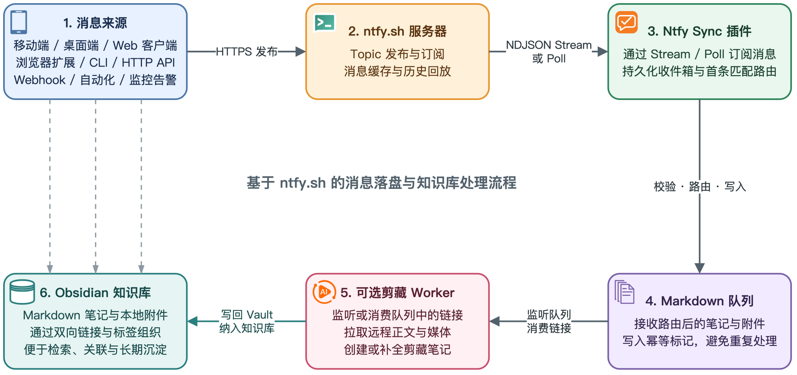
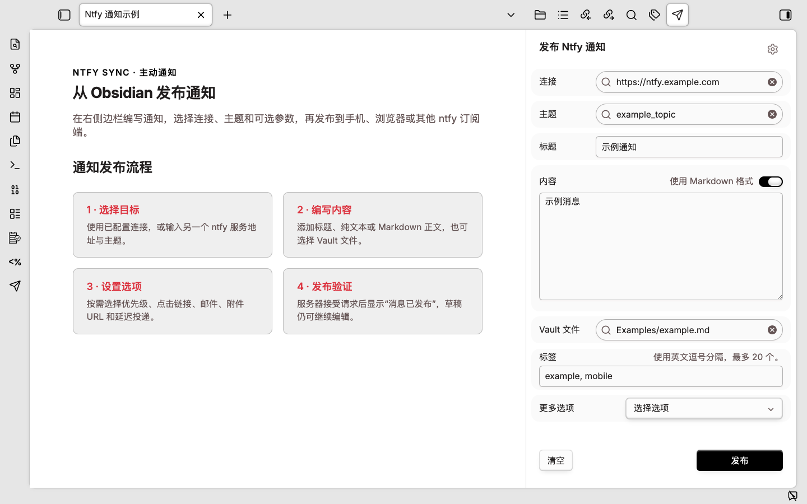
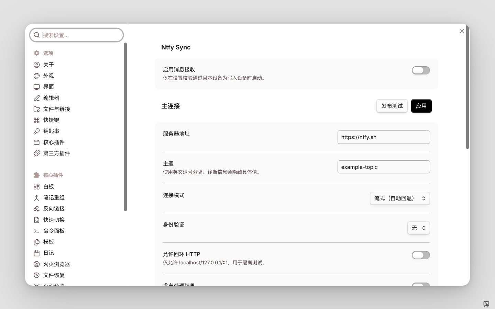
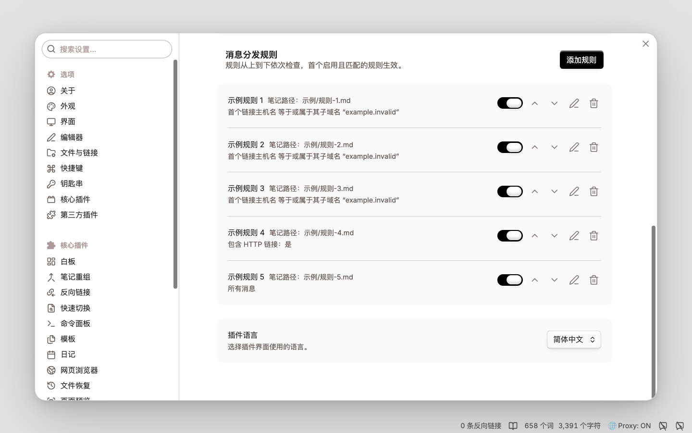
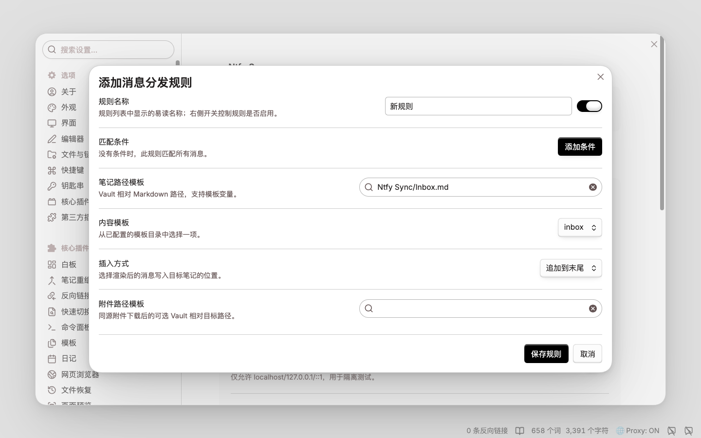
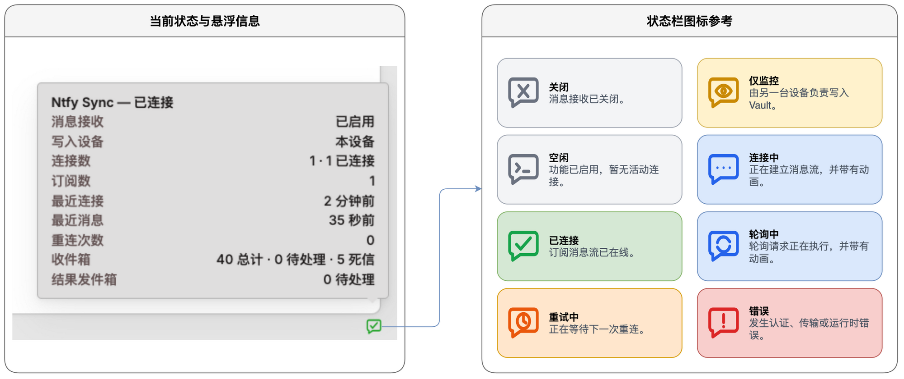

# Ntfy Sync

[English](README.md) | [简体中文](README_CN.md)

Ntfy Sync 将桌面端 Obsidian 连接到用户配置的 ntfy 服务器。移动应用、浏览器扩展、脚本及其他 ntfy 客户端发布的消息，可通过流式订阅或轮询接收，再依据有序的首条匹配规则路由为 Markdown 笔记。规则可匹配 Topic、标题、消息正文、标签、优先级、URL 和附件元数据；可配置模板则用于控制目标笔记、写入内容、插入模式及附件路径。

插件会在处理前持久化已接收的消息，并通过幂等标记避免重连或历史回放造成重复写入。它支持经过身份验证的公共或自托管 ntfy 服务器、受保护的同源附件下载、持久化恢复、死信重试、脱敏诊断，以及将处理结果可选发布到独立的 ntfy Topic。Ntfy Sync 仅支持桌面端 Obsidian。

## 消息处理流程



1. **消息来源** — 移动端、桌面端和 Web 客户端，以及浏览器扩展、CLI、HTTP API、Webhook 和自动化系统通过 HTTPS 发布消息。
2. **ntfy.sh 服务器** — 提供 Topic 发布与订阅、消息缓存和历史回放。
3. **Ntfy Sync 插件** — 通过 NDJSON Stream 或 Poll 订阅消息，持久化已接收的数据，并按首条匹配规则确定路由。
4. **Markdown 队列** — 在 Obsidian Vault 中接收路由后的笔记和附件，并写入幂等标记以避免重复处理。
5. **可选剪藏 Worker** — 监听或消费队列中的链接，拉取远程正文与媒体，并创建或补全剪藏笔记。
6. **Obsidian 知识库** — 通过双向链接和标签组织 Markdown 笔记与本地附件，便于检索、关联和长期沉淀。

## 功能特性

### 接收与路由

- 原生 NDJSON stream、定时 poll、重叠回放、重连退避，以及 stream 自动降级到 poll。
- 带校验和、备份恢复、容量上限、dead letter 和手动重试的 JSON durable inbox。
- 新安装仅提供一条通用 Inbox 规则；用户可在结构化规则编辑器中添加按域名、topic 或 tag 匹配的路由。
- 同源附件下载带 redirect 和字节数限制；跨源附件保留为转义链接。
- 有序的 **Message distribution rules** 卡片，支持快速启停、添加、编辑、删除、优先级调整。

### 主动发送

- 右侧边栏**发布 Ntfy 通知**界面，支持可编辑连接、主题、标题、标签、Markdown、Vault 或 URL 附件、优先级。
- 内置**发布测试**弹窗，可向已配置的输入主题发布测试文本。
- 可通过 minimal 或含路径的 result outbox，将处理结果发布到独立 topic。

## 初始配置

如果尚不熟悉 ntfy，可先阅读官方 [ntfy 快速入门文档](https://docs.ntfy.sh/#getting-started)，其中介绍了订阅 topic 和发送第一条消息的方法。

1. 分别创建不可猜测的 input topic 和 result topic。使用自托管 ntfy 时，分别授予满足读写方向的最小 ACL。
2. 打开 **设置 → 第三方插件 → Ntfy Sync**，配置服务器、input topics、transport mode 和读取认证。
3. 可将处理结果发布到独立 Topic，并使用单独的写入凭据；默认启用 minimal 隐私模式和结果缓存。
4. 检查 **Message distribution rules**，规则自上而下匹配；使用箭头调整优先级。
5. 编辑规则后，点击**应用**左侧的**发布测试**，验证消息能否按规则写入目标笔记。
6. 点击功能区图标，或运行 **Ntfy Sync：打开消息发送器**，从右侧边栏发布通知。

## 发布 Ntfy 通知

打开右侧边栏发送器，无需浏览器或命令行即可在一个界面中完成发布流程。



1. 选择已配置的连接和建议主题。
2. 填写标题与纯文本或 Markdown 正文，并可选择当前 Vault 中的一个文件。
3. 添加标签，或展开**更多选项**设置优先级、点击链接、邮件转发、远程附件和延迟投递。
4. 点击**发布**或按 `Ctrl/Cmd+Enter`。

可用的 Obsidian 命令：

- **Ntfy Sync：打开消息发送器**
- **Ntfy Sync：发送选中内容**
- **Ntfy Sync：发送当前笔记链接**
- **Ntfy Sync：发送当前 Vault 文件**

## 界面导览

以下三个设置界面覆盖消息接收、路由和规则编辑，图中内容均为脱敏的示例数据。

### 通用配置

配置消息接收和ntfy连接信息。



### 规则列表

规则自上而下匹配，每个规则都提供快速启停、优先级调整、编辑和删除。



### 规则配置

规则按顺序执行首条匹配。在结构化编辑器中配置条件和目标笔记，并将兜底规则放在最后。



规则字段、条件操作符、路径约束和模板变量详见[配置参考](docs/configuration-reference-cn.md)。

## 状态图标与悬浮信息

状态栏气泡可区分 **关闭**、**仅监控**、**空闲**、**连接中**、**已连接**、**轮询中**、 **重试中** 和 **错误** 八种状态，连接中和轮询中使用轻微动画，鼠标悬停显示详细状态摘要。



| 悬浮窗行 | 具体含义 |
| --- | --- |
| `Ntfy Sync — Connected` | 根据插件开关和全部连接状态计算出的总体状态。 |
| `Receiving: enabled` | 插件设置中是否启用了消息接收和处理。 |
| `Writer: this device` | 当前设备是否负责写入 Vault；`another device` 表示仅监控。 |
| `Connections: 1 · 1 connected` | connection runner 总数，以及各运行状态的数量分布。 |
| `Subscriptions: 1` | 所有 connection 配置的输入订阅总数；不会显示 topic 名称。 |
| `Last connected: just now` | 最近一次成功建立连接距当前的相对时间。 |
| `Last message: just now` | 最近一次收到事件距当前的相对时间；不会显示消息内容。 |
| `Reconnect attempts: 0` | 所有活动 connection runner 的重连次数总和。 |
| `Last fault: <code>` | 仅在有传输错误时显示错误码。 |
| `Inbox: 4 total · 0 pending · 0 dead letter` | Durable inbox 总数、未完成数量及 dead-letter 数量。 |
| `Result outbox: 0 pending` | 等待发布的结果数量。 |

## 运行时命令

- **Ntfy Sync: Reconnect** — 停止当前 transport，并根据已校验设置重新创建连接。
- **Ntfy Sync: Retry dead-letter messages** — 重新排队失败消息，不清除既有错误历史。
- **Ntfy Sync: Export redacted diagnostics** — 在 `Obsidian/ntfy/` 下生成不含正文、credential 和 topic 的诊断摘要。

## 恢复与回滚

运行状态保存在插件目录旁的 `state-v1.json`，包含校验和及上一份 snapshot 备份。主文件损坏时会隔离并从备份恢复；如果主文件和备份都损坏，插件会停止，而不是静默重建并重新处理全部消息。诊断时应保留损坏文件，并在手工恢复前使用脱敏诊断导出命令。

回滚时先禁用 **Ntfy Sync**，确认状态变为 off。禁用会终止 stream 和 poll timer，但不会删除已经写入的笔记或附件。只有 ntfy 输入停止后，才能为对应路由启用其他 ingress；除非下游流程本身具备幂等性，否则禁止两个 transport 同时写入同一队列。

## 环境要求与构建

- 桌面端 Obsidian 1.12.7 或更高版本。
- 开发环境 Node.js 22 或更高版本（`.nvmrc` 使用 Node 22）。

```sh
npm ci
npm run verify
```

可安装文件为 `main.js`、`manifest.json` 和 `styles.css`。安装到隔离测试 Vault：

```sh
npm run build
npm run install:test-vault
```

将 `OBSIDIAN_NTFY_TEST_VAULT` 设置为目录名中包含 `test` 的隔离 Vault；`install:test-vault` 会拒绝其他目标。只有完成下述部署检查后，才应手工安装到生产 Vault。

## 自动化验收

| 命令 | 验收范围 |
| --- | --- |
| `npm run verify` | 格式、lint、类型检查、单元/契约/集成测试、覆盖率、敏感信息扫描、构建、可复现性及发布包检查。 |
| `npm run test:ui` | 将构建安装到隔离测试 Vault，操作规则编辑器，验证持久化与重新加载，并恢复原设置。 |
| `npm run test:acceptance` | 执行 UI gate 及 stream、poll 场景，覆盖重连、附件、重复写入防护、结果隐私、回滚和清理。 |

验收报告写入已忽略的 `.artifacts/` 目录。

## 安全与已知限制

- 凭据存储在 Obsidian `data.json` 中，本地文件系统和 Vault Sync 权限构成安全边界。
- 幂等标记可实现 Vault 的 effective-once 写入，但不保证分布式 exactly-once；早于 ntfy 服务器缓存的消息无法恢复。
- 插件不执行 ntfy action，不同步远端 delete/clear 事件，也不支持移动端后台运行。
- 生产使用前应验证系统休眠/唤醒，以及部署环境的 TLS、CORS、代理和缓存配置。详见 [SECURITY.md](SECURITY.md)。

## 许可证与来源

项目采用 `AGPL-3.0-only` 许可证，受 Obsidian Telegram Sync 启发。
