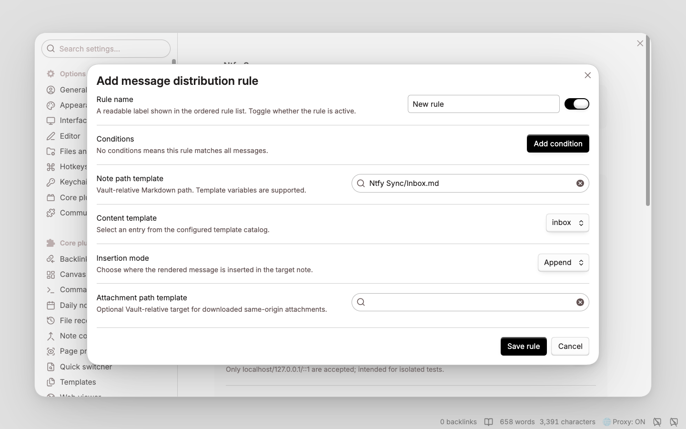

# Ntfy Sync configuration reference

[English](configuration-reference.md) | [简体中文](configuration-reference-cn.md)

This reference documents rule evaluation, condition operators, action fields, path constraints, and template variables. For installation and a concise product overview, see the [README](../README.md).

## Rule evaluation

- Rules are evaluated from top to bottom.
- Disabled rules are skipped; the first enabled rule whose conditions all match takes effect, and matching then stops.
- Conditions within a rule use **AND** logic. To express OR, create multiple rules with the same action.
- A rule with no conditions matches every message, so a catch-all rule should normally be last.

## Rule fields

| Setting | Description |
| --- | --- |
| **Rule name** | A readable label shown in the ordered rule list. It does not affect matching. |
| **Enabled** | Includes or excludes the rule from evaluation without deleting it. |
| **Conditions** | All listed conditions must match. **Add condition** adds another AND condition; no conditions means all messages. |
| **Note path template** | Vault-relative destination ending in `.md`, for example `Ntfy Sync/{{messageDate:YYYY-MM}}.md`. Absolute paths, `.`/`..`, empty path components, and paths outside the Vault are invalid. |
| **Content template** | Selects the configured template used to render the message block. Every written block also receives the forced `ntfy-sync:v1` marker for idempotency. |
| **Insertion mode** | **Append** writes at the end; **Prepend** writes at the beginning; **After heading** writes at the end of the named Markdown section. |
| **Heading** | Required for **After heading** and matched as an exact trimmed Markdown heading such as `### Inbox`. If absent from the note, the heading is created before the block is inserted. |
| **Attachment path template** | Optional Vault-relative target for an automatically downloaded attachment. It is used only when attachment downloading is enabled and the attachment satisfies the same-origin/security policy; otherwise the content receives a link to the attachment. Leaving it blank selects link-only behavior. |

## Conditions

Text matching is case-sensitive. Empty string values are invalid. ntfy priority is `1` (minimum) through `5` (maximum), and defaults to `3` when the publisher omits it.

| Field | Available operators | What is matched / example |
| --- | --- | --- |
| **Topic** | `equals`, `contains`, `starts with` | The exact source topic string. `equals` is safest when routing one topic. |
| **Title** | `equals`, `contains`, `starts with` | The optional ntfy title; a missing title is an empty string. |
| **Message body** | `equals`, `contains`, `starts with` | The ntfy message text. These are literal, case-sensitive comparisons, not regular expressions. |
| **Has tag** | `is` | Whether the message tag array contains one complete, case-sensitive tag. `urgent` does not match a tag named `very-urgent`. |
| **Priority** | `equals`, `is at least` | The numeric ntfy priority. `is at least 4` matches priorities 4 and 5. |
| **Has attachment** | `equals` with Yes/No | Whether ntfy supplied an attachment descriptor; this does not mean the attachment was downloaded successfully. |
| **Has HTTP URL** | `equals` with Yes/No | Whether a valid `http://` or `https://` URL was found while scanning the title first and then the message body. The ntfy click-action URL is not used by this condition. |
| **Attachment MIME type** | `equals`, `starts with` | The MIME type announced by ntfy, such as `image/png`; `starts with image/` matches any announced image type. The searchable field offers common MIME presets and a clear control while continuing to accept custom values. A missing MIME type does not match a non-empty value. |
| **First URL host** | `host equals`, `host or subdomain of` | The hostname of the first HTTP(S) URL found in the title/body. Enter only a host such as `github.com`, without a scheme, port, or path. Hostnames are IDNA-normalized and lowercased. `host or subdomain of` matches `github.com` and `docs.github.com`, but not `evilgithub.com`. |

Operator meanings vary slightly by field:

- `equals` compares the complete value; for text fields it is case-sensitive.
- `contains` is a literal substring check for Topic, Title, and Message body.
- `is` checks for one complete item in the message tag array.
- `starts with` is a literal prefix check. For Attachment MIME type, a value such as `image/` matches the whole MIME family.
- `is at least` is a numeric `>=` comparison.
- `host equals` matches one normalized hostname exactly; `host or subdomain of` additionally accepts labels below that hostname while preserving the domain boundary.

## Path and content template variables

The note path, attachment path, and content templates support the following variables. Date/time values are rendered in UTC. Supported date format tokens are `YYYY`, `MM`, `DD`, `HH` (24-hour), `hh` (12-hour), `mm`, `ss`, and `SSS`; separators such as `-`, `/`, `_`, spaces, and `:` are allowed.

| Variable | Value |
| --- | --- |
| `{{content}}`, `{{content:N}}` | Full message body, or its first `N` characters. |
| `{{title}}`, `{{topic}}` | Message title and source topic. |
| `{{messageId}}`, `{{sequenceId}}` | ntfy message ID and optional sequence ID. |
| `{{priority}}` | Priority from 1 through 5. |
| `{{tags}}`, `{{tag:[N]}}` | Comma-separated tags, or the zero-based tag at index `N`. |
| `{{url1}}`, `{{url1:host}}` | First HTTP(S) URL found in title/body, and its normalized hostname. |
| `{{attachment:name}}`, `{{attachment:type}}` | Announced attachment filename and MIME type. |
| `{{messageDate:FORMAT}}`, `{{messageTime:FORMAT}}` | ntfy publication time using the requested format. |
| `{{receivedDate:FORMAT}}` | Local receipt time using the requested format. |
| `{{file:path}}`, `{{file:link}}`, `{{file:embed}}` | Downloaded attachment path, wikilink, and embed. These are intended for content templates and are empty when no attachment target is available. |

Use only the listed variables. Settings validation rejects unsupported variables before a rule can be saved or enabled. Dynamic path components are sanitized, but the resulting path must still be a valid Vault-relative path.

## Example order

1. **GitHub links** — `First URL host` / `host or subdomain of` / `github.com` → `Clippings/GitHub.md`.
2. **High priority** — `Priority` / `is at least` / `4` → `Ntfy Sync/Urgent.md`.
3. **Inbox fallback** — no conditions → `Ntfy Sync/Inbox.md`.

With this order, a priority-5 GitHub message is handled by **GitHub links**, because first-match evaluation stops before **High priority**.

